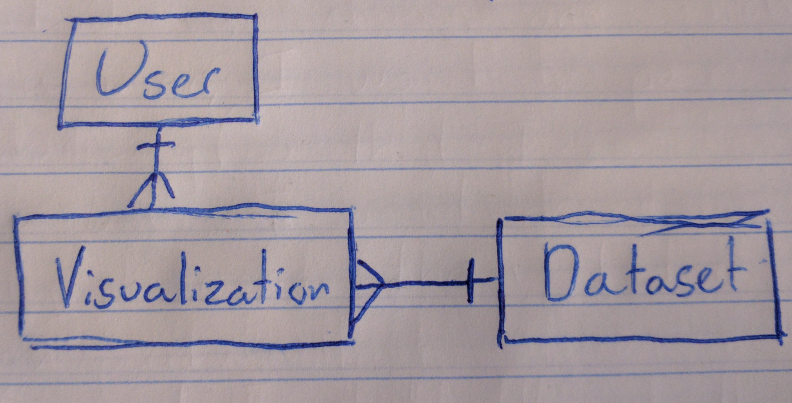

# Captsone Project API

## ERDs

The following is the Entity Relationship Diagram for the first version of this app, this will likely change as more features are added.

## API Endpoints

| Verb | URI pattern | Controller#Action |
|--|--|--|
| POST | `/sign-up` |	`users#signup` |
| POST | `/sign-in` |	`users#signin` |
| DELETE | `/sign-out/:id` |	`users#signout` |
| PATCH |	`/change-password/:id` |	`users#changepw` |
| GET | `/datasets` | `datasets#index` |
| GET | `/datasets/:id` | `datasets#show` |
